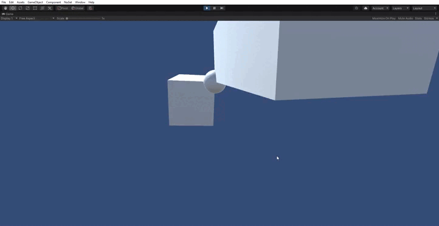

# articulated-solids
Este proyecto consiste en un sistema de simulación de sólidos rígidos articulados en Unity, donde múltiples cuerpos están conectados mediante restricciones (constraints).

El objetivo principal es estudiar:

- Dinámica de sólidos rígidos
- Sistemas con restricciones
- Integración numérica (explícita, implícita)
- Estabilidad en sistemas acoplados



## El sistema

La simulación está formada por:

- **RigidBody**
    - Posición (`x`)
    - Rotación (`q`)
    - Velocidad lineal (`v`)
    - Velocidad angular (`ω`)
- **Constraints (restricciones)**
    - Conectan cuerpos entre sí
    - Imponen condiciones (por ejemplo: mantener dos puntos juntos)
- **PhysicsManager**
    - Controla el paso de simulación
    - Ejecuta distintos integradores

## Modelo físico

El comportamiento de cada sólido viene dado por la **segunda ley de Newton**:

$F=ma$ 

y su equivalente rotacional:   $\tau = I \alpha$

Donde:

- F → fuerza total
- m → masa
- a → aceleración
- τ → torque
- I → tensor de inercia
- α → aceleración angular

## Fuerzas en el sistema

Cada cuerpo recibe varias fuerzas:

### Gravedad

Empuja el objeto hacia abajo:

$Fg=m⋅g$

### Amortiguamiento (Damping)

Reduce la energía del sistema, es clave para evitar que el sistema gane energía artificial:

- Lineal:   $Fd=−c⋅v$
- Angular:   $τd=−c⋅I⋅ω$

```csharp
public void GetForce(VectorXD force)
{
    Vector3 Force = Mass * Manager.Gravity - Damping * Mass * m_vel;
    force.SetSubVector(index, 3, Utils.ToVectorXD(Force));

    Vector3 Torque =
        -Vector3.Cross(m_omega, Utils.ToVector3(m_inertia * Utils.ToVectorXD(m_omega)))
        - Damping * Utils.ToVector3(m_inertia * Utils.ToVectorXD(m_omega));

    force.SetSubVector(index + 3, 3, Utils.ToVectorXD(Torque));
}
```

### Restricciones (Constraints)

Las restricciones no son fuerzas físicas reales, sino condiciones que el sistema debe cumplir.

Por ejemplo, una **Point Constraint** obliga a que dos puntos coincidan:

$C(x)=xA−xB=0$

Para resolver esto, el sistema introduce fuerzas internas que corrigen el error.

```csharp
private VectorXD GetC()
{
    Vector3 posA = (bodyA != null) ? bodyA.PointLocalToGlobal(pointA) : pointA;
    Vector3 posB = (bodyB != null) ? bodyB.PointLocalToGlobal(pointB) : pointB;

    return Utils.ToVectorXD(posA - posB);
}
```

## Ecuación general del sistema

Un sistema de sólidos rígidos con restricciones puede escribirse como:

$M \dot{v} = F + J^T \lambda$

Donde:

- M → matriz de masas
- F → fuerzas externas
- J→ Jacobiana de constraints
- λ→ multiplicadores de Lagrange

# Funcionamiento de la simulación

En cada frame se realiza:

## 1. Calcular fuerzas

Para cada sólido rígido:

- Gravedad
- Damping (lineal y angular)
- Fuerzas de constraints (dependiendo del método)

$F_{\text{total}} = F_{\text{gravedad}} + F_{\text{damping}} + F_{\text{constraints}}$

## 2. Obtener aceleración

A partir de  $M \dot{v} = F$

Se obtiene: $\dot{v} = M^{-1} F$

## 3. Aplicar restricciones

Dependiendo del método:

- Débiles → como fuerzas
- Fuertes → resolviendo un sistema con Jacobianas

## 4. Integrar en el tiempo

# Métodos de integración

En este proyecto he implementado tres enfoques principales:

- Euler simpléctico (explícito)
- Euler implícito
- Euler simpléctico con restricciones fuertes

Cada uno tiene comportamientos muy distintos.

## Euler simpléctico (restricciones débiles)

### Cómo funciona

1. Se calculan fuerzas (incluyendo constraints como fuerzas)
2. Se actualiza velocidad
3. Se actualiza posición con la nueva velocidad

$v_{t+1} = v_t + \Delta t \cdot M^{-1} F$

$x_{t+1} = x_t + \Delta t \cdot v_{t+1}$

### Características

- Muy rápido
- Fácil de implementar
- Aceptablemente estable

```csharp
**private void stepSymplectic()
{
    VectorXD v = new DenseVectorXD(m_numDoFs);
    VectorXD f = new DenseVectorXD(m_numDoFs);
    MatrixXD Minv = new DenseMatrixXD(m_numDoFs);

    f.Clear();
    Minv.Clear();

    foreach (ISimulable obj in m_objs)
    {
        obj.GetVelocity(v);
        obj.GetForce(f);
        obj.GetMassInverse(Minv);
    }

    foreach (IConstraint constraint in m_constraints)
        constraint.GetForce(f);

    v += TimeStep * (Minv * f);
    VectorXD dx = TimeStep * v;

    foreach (ISimulable obj in m_objs)
    {
        obj.AdvanceIncrementalPosition(dx);
        obj.SetVelocity(v);
    }
}**
```

## Euler implícito (restricciones débiles)

### Cómo funciona

En lugar de usar fuerzas actuales, el método usa una aproximación del futuro mediante jacobianas:

$A v_{t+1} = b$

donde:

$A = M - \Delta t \cdot \frac{\partial F}{\partial v} - \Delta t^2 \cdot \frac{\partial F}{\partial x}$

### Características

- Mucho más estable
- Permite sistemas rígidos
- Evita explosiones numéricas
- Más caro computacionalmente

```csharp
private void stepImplicit()
{
    VectorXD x = new DenseVectorXD(m_numDoFs);
    VectorXD v = new DenseVectorXD(m_numDoFs);
    VectorXD f = new DenseVectorXD(m_numDoFs);

    MatrixXD M = new DenseMatrixXD(m_numDoFs);
    MatrixXD dfdx = new DenseMatrixXD(m_numDoFs);
    MatrixXD dfdv = new DenseMatrixXD(m_numDoFs);

    foreach (ISimulable obj in m_objs)
    {
        obj.GetPosition(x);
        obj.GetVelocity(v);
        obj.GetForce(f);
        obj.GetMass(M);
        obj.GetForceJacobian(dfdx, dfdv);
    }

    MatrixXD A = M - TimeStep * dfdv - TimeStep * TimeStep * dfdx;
    VectorXD b = (M - TimeStep * dfdv) * v + TimeStep * f;

    A.Solve(b, v);
    VectorXD dx = TimeStep * v;

    foreach (ISimulable obj in m_objs)
    {
        obj.AdvanceIncrementalPosition(dx);
        obj.SetVelocity(v);
    }
}
```

## Euler simpléctico con restricciones fuertes

### Idea clave

En lugar de aproximar las constraints como fuerzas, se imponen directamente resolviendo:

$\begin{bmatrix}
M & -\Delta t J^T \\
J & 0
\end{bmatrix}
\begin{bmatrix}
v \\
\lambda
\end{bmatrix}
=
\begin{bmatrix}
Mv + \Delta t F \\
-\frac{1}{\Delta t} C
\end{bmatrix}$

- J → cómo afectan las posiciones a las constraints
- λ→ fuerzas internas necesarias para cumplirlas

### Características

- Las restricciones se cumplen correctamente
- El sistema es mucho más estable estructuralmente
- Sistema más grande
- Más costoso
- Sensible a errores en la Jacobiana

```csharp
private void stepSymplecticConstraints()
{
    VectorXD x = new DenseVectorXD(m_numDoFs);
    VectorXD v = new DenseVectorXD(m_numDoFs);
    VectorXD f = new DenseVectorXD(m_numDoFs);
    MatrixXD M = new DenseMatrixXD(m_numDoFs);

    MatrixXD J = new DenseMatrixXD(m_numConstraints, m_numDoFs);
    VectorXD c = new DenseVectorXD(m_numConstraints);

    foreach (ISimulable obj in m_objs)
    {
        obj.GetPosition(x);
        obj.GetVelocity(v);
        obj.GetForce(f);
        obj.GetMass(M);
    }

    foreach (IConstraint constraint in m_constraints)
    {
        constraint.GetConstraintJacobian(J);
        constraint.GetConstraints(c);
    }

    int n = m_numDoFs;
    int m = m_numConstraints;

    MatrixXD A = new DenseMatrixXD(n + m, n + m);
    VectorXD b = new DenseVectorXD(n + m);

    A.SetSubMatrix(0, 0, M);
    A.SetSubMatrix(0, n, -TimeStep * J.Transpose());
    A.SetSubMatrix(n, 0, J);

    b.SetSubVector(0, n, M * v + TimeStep * f);
    b.SetSubVector(n, m, (-1.0 / TimeStep) * c);

    VectorXD sol = new DenseVectorXD(n + m);
    A.Solve(b, sol);

    VectorXD v_new = sol.SubVector(0, n);
    VectorXD dx = TimeStep * v_new;

    foreach (ISimulable obj in m_objs)
    {
        obj.AdvanceIncrementalPosition(dx);
        obj.SetVelocity(v_new);
    }
}
```

# Comparativa

| Método | Estabilidad | Precisión | Coste |
| --- | --- | --- | --- |
| Euler simpléctico | Media | Baja | Muy bajo |
| Implícito | Alta | Media | Medio |
| Constraints fuertes | Muy alta | Alta | Alto |
